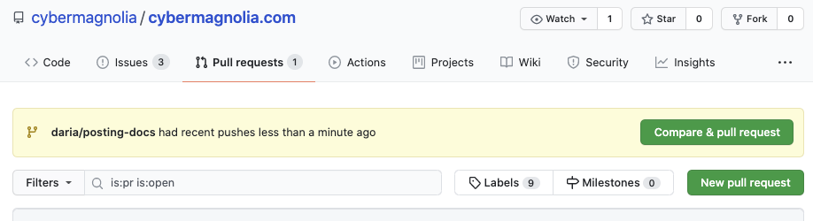
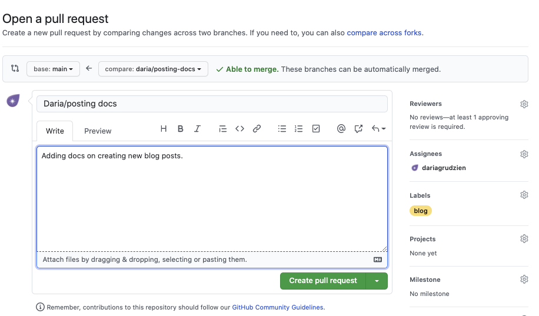
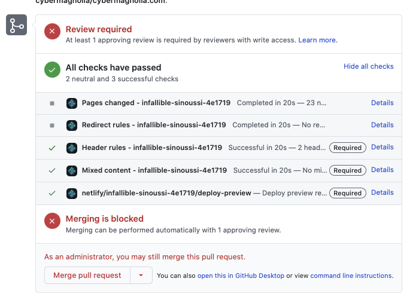

# Adding Blog Posts

We'd like every member of CyberMagnolia's core team and community to be able to contribute articles to the [website](https://cybermagnolia.com/)

Here's a guide to help you do it. If you have any difficulties, please reach out to [Daria](https://twitter.com/DariaGrudzien) who will be happy to help you.

## Prerequisites

* Basic knowledge of [git](https://www.git-tower.com/blog/git-cheat-sheet/) & [Markdown](https://github.com/adam-p/markdown-here/wiki/Markdown-Cheatsheet)
* Ability to use command line
* This repository cloned on your computer
* Initialized submodule with the blog theme

Here are the commands to clone the repo and initialize the submodule:

```sh
    git clone git@github.com:cybermagnolia/cybermagnolia.com.git
    cd <your cybermagnolia.com project directory>
    git submodule init
```

## Creating The Pull Request With Your Post

There are few common conventions that make cooperating on a repository easier. Here are the things to keep in mind when creating the pull request:

1. Make sure to create your own branch with your name prefix in it, like in this example:

```sh
    git checkout -b daria/add-jane-smith-interview
```

2. When commiting the changes, add a meaningful message following the [commitizen](https://raw.githubusercontent.com/commitizen/cz-cli/master/meta/screenshots/add-commit.png) standard, like int his exmaple:

```sh
    git add .
    git commit -m "feat: add jane smith interview"
```

3. Push your branch to GitHub:

```sh
    git push -u origin daria/add-jane-smith-interview
```

4. Go to [GitHub](https://github.com/cybermagnolia/cybermagnolia.com) and create a pull request (if you don't see a pop-up with suggestion to create a new branch, go to [pulls](https://github.com/cybermagnolia/cybermagnolia.com/pulls) and click on the `New pull request button`. Then select your branch as a comparison.)



5. Edit the PR - set yourself as the assignee, select reviewers, add a `blog` label. Add a brief description of the post content if you'd like and hit `Create pull request`.



6. Once you create the PR, there will be some automatic checks running - make sure that the required checks pass:




## Adding Posts

There are two ways to add the blog post:

* By creating the file [manually](#adding-posts-by-manually-creating-files)
* By creating the file [with Hugo](#creating-new-blog-post-with-hugo) and previewing it locally

### Adding Posts By Manually Creating Files

* Go to the `content/blog/` directory:

```sh
    cd <your cybermagnolia.com project directory>
    cd content/blog/
```

* create a new markdown file in the blog directory - it's title will become the URL of the blog post so use dashes to separate words (e.g. `jane-smith-interview.md`)

```sh
    touch <jane-smith-interview.md>
```

* Copy the headers from another post in the same directory (i.e. everything at the top of the post including `+++` section markers)

```md
    +++
    title = "Online Happy Hours December 2020"
    description = "Join us for our next friendly & informal online chat"
    author = "Daria Grudzien"
    date = "2020-11-25"
    tags = ["happy_hours", "meetup"]
    [[images]]
    src = "/img/happyhours_post.png"
    alt = "Photo"
    stretch = "stretchH"
    +++
```

* Update all relevant fields: `title`, `description`, `author`, `date`, `tags`

* To update the image source (`src` from the previous example), upload the post cover photo of your choice into `static/img/` directory with some meaningful name, e.g. `jane_smith_interview.jpg`

* Update `src` in your blog post header with the name of the file you've just added while keeping the `/img/` directory:

```md
    [[images]]
    src = "/img/jane_smith_interview.jpg"
```

* Commit the changes:


```sh
    git checkout -b daria/add-jane-smith-interview
```


## Creating New Blog Post With Hugo

*
