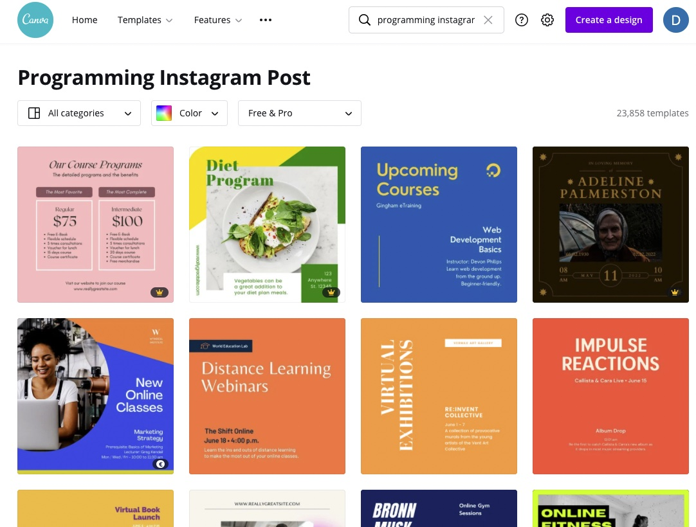

# Creating Images

There's no single prescribed way to create images for blog post covers - this is largely an ongoing experiment.

## General Guidelines

### Size

It seems that 1200 x 960 pixels is the most optimal image size. It works fine as the post cover, and it is well displayed by most social media. Make sure to keep the important content within the center of the post - so that when social media previews shop the post a bit, most of it will still be well visible. See latest blog posts for examples.

### Format

It's a good rule of thumb to stick to JPG for any larger photo (decent quality & small image size). If you need a transparent image background then PNG will be a good choice.

### Design Assets

We share the brand book, fonts, some image templates in a dedicated `CyberMagnolia Google Drive folder`. Please ping `@Daria Grudzien` on CyberMagnolia Slack for access to the folder.

### Software

It's totally up to you how you create the designs. I personally recommend [Canva](https://www.canva.com/) wholeheartedly — even on a free plan it comes with a load of templates, fonts, pictures, etc. It's easy to drag and drop elements around, and you can upload your own files as well.

